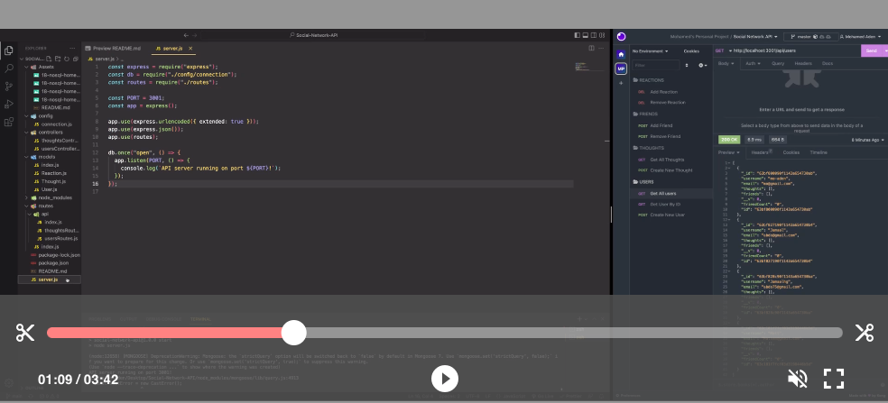

# Social-Network-API

Following the user story below, I created a social network Api
that uses the latest technology of MongoDB database.

## User Story

```md
AS A social media startup
I WANT an API for my social network that uses a NoSQL database
SO THAT my website can handle large amounts of unstructured data
```

## Acceptance Criteria

```md
GIVEN a social network API
WHEN I enter the command to invoke the application
THEN my server is started and the Mongoose models are synced to the MongoDB database
WHEN I open API GET routes in Insomnia for users and thoughts
THEN the data for each of these routes is displayed in a formatted JSON
WHEN I test API POST, PUT, and DELETE routes in Insomnia
THEN I am able to successfully create, update, and delete users and thoughts in my database
WHEN I test API POST and DELETE routes in Insomnia
THEN I am able to successfully create and delete reactions to thoughts and add and remove friends to a user’s friend list
```

The App has the following routes and can be used to get any user or thought information needed.

### API Routes

**`/api/users`**

- `GET` all users

- `GET` a single user by its `_id` and populated thought and friend data

- `POST` a new user:

```json
// example data
{
  "username": "lernantino",
  "email": "lernantino@gmail.com"
}
```

- `PUT` to update a user by its `_id`

- `DELETE` to remove user by its `_id`

**BONUS**: Remove a user's associated thoughts when deleted.

---

**`/api/users/:userId/friends/:friendId`**

- `POST` to add a new friend to a user's friend list

- `DELETE` to remove a friend from a user's friend list

---

**`/api/thoughts`**

- `GET` to get all thoughts

- `GET` to get a single thought by its `_id`

- `POST` to create a new thought (don't forget to push the created thought's `_id` to the associated user's `thoughts` array field)

```json
// example data
{
  "thoughtText": "Here's a cool thought...",
  "username": "lernantino",
  "userId": "5edff358a0fcb779aa7b118b"
}
```

- `PUT` to update a thought by its `_id`

- `DELETE` to remove a thought by its `_id`

---

**`/api/thoughts/:thoughtId/reactions`**

- `POST` to create a reaction stored in a single thought's `reactions` array field

- `DELETE` to pull and remove a reaction by the reaction's `reactionId` value.

### Watch the video below for a short Demo

[](https://drive.google.com/file/d/1-DcAYFHDTWi3E0oJC2DPlujRC7bjbaBS/view "Demo Video")
